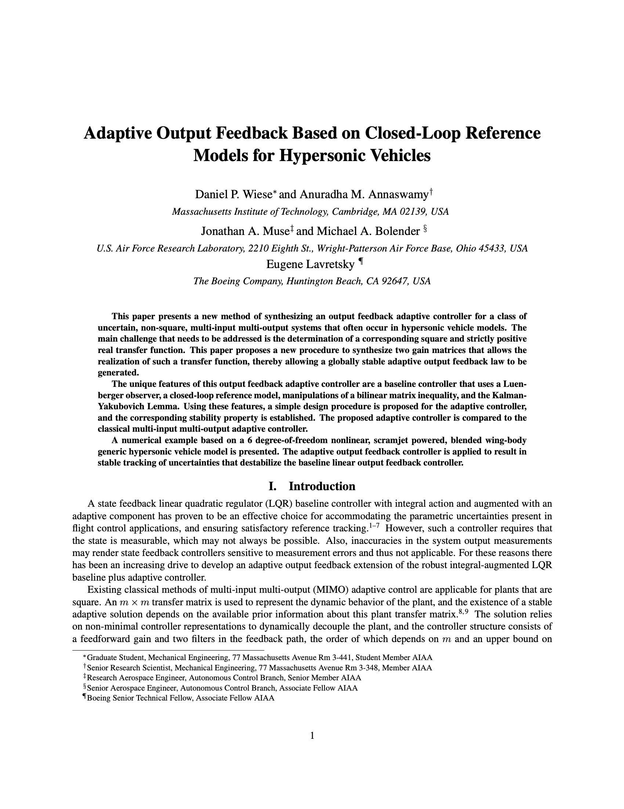

# AIAA GNC 2015: Adaptive Output Feedback Based on Closed-Loop Reference Models for Hypersonic Vehicles


<p align="center">
  
</p>

## Generating Output

```sh
# To make generate the PDF from source
make pdf

# To clean temporary and output files
make clean
```
